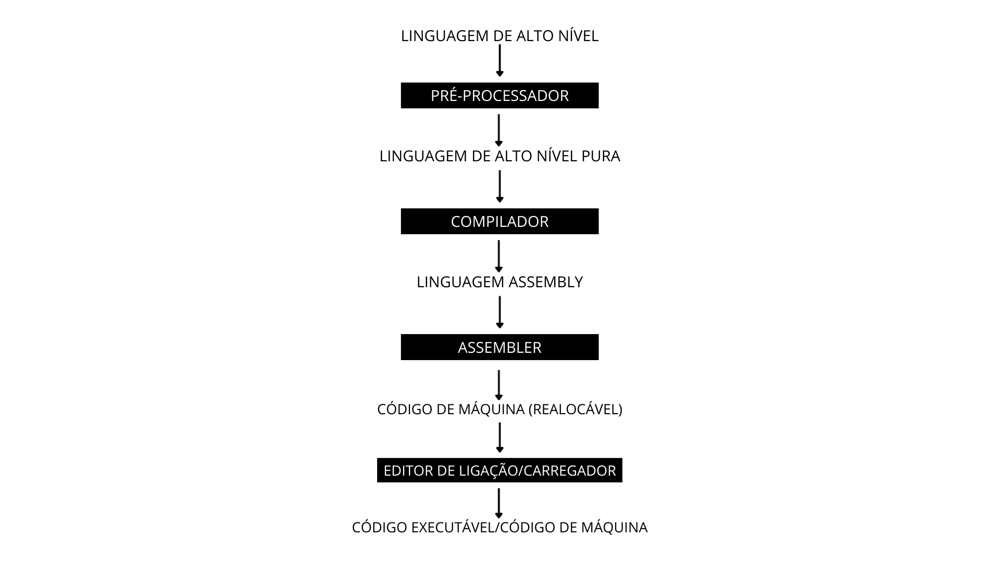
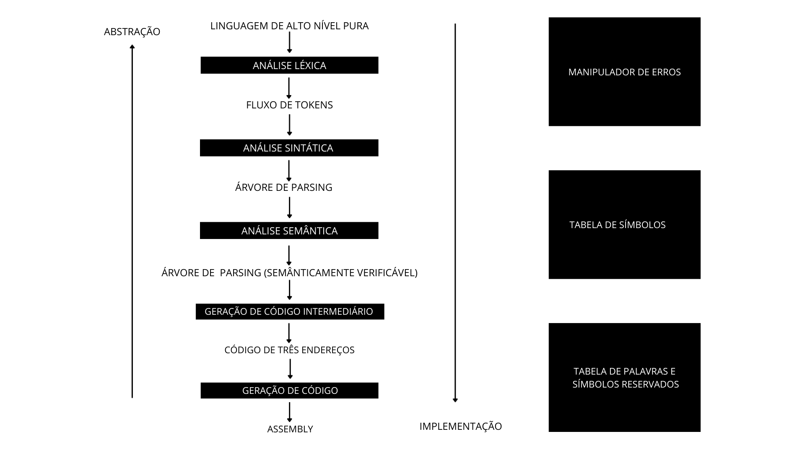

# Projeto de Pesquisa Curricularizada da Graduação - Compiladores 

Este projeto tem como objetivo construir um mini compilador capaz de reconhecer, analisar e traduzir uma linguagem de expressões matemáticas com suporte a funções definidas pelo usuário, variáveis, operadores aritméticos e escopo simples. 

## Integrantes
* Amanda Naraoka - 6992344
* Gustavo Marcos Xavier - 6951289
* Leonardo de Almeida Pereira - 8962047
* Lucas Vinicius Dimarzio Carneiro - 6378748
* Marcelo Berger Gil - 8807370
* Vinicius Lustosa Silva – 8861753

## Escopo do Projeto
O objetivo do projeto é criar um mini compilador. A criação de um compilador é bastante complexa, o foco do projeto foi apenas na parte da síntese de um compilador, ou seja, apenas o frontend.
O escopo do projeto do mini compilador foi dividido em três partes: 
1)	Focada na análise léxica 
2)	Focada na análise sintática
3)	Focada na análise semântica

Um processador de linguagem de forma visual:


Um compilador de forma visual:


## Sobre a linguagem AGLLMV
Em todo compilador precisamos de uma linguagem de programação para realizar o processo de compilação, sabendo disso o grupo resolveu criar uma linguagem, ela foi batizado com o nome de “Linguagem AGLLMV”, que são as iniciais dos integrantes (Amanda, Gustavo, Leonardo, Lucas, Marcelo e Vinicius) de forma ordenada alfabeticamente. O foco da linguagem vai ser o uso de expressões matemáticas.

## Funcionalidades da linguagem AGLLMV:
- Declarar variáveis (inteiros e floats) e funções: `function name(param1, param2) = expression`
- Atribuições: `x = expression`
- Chamadas de função: `f(1, 2)`
- Utilizar/reconhecer/analisar/traduzir expressões matemáticas
- Utilizar números inteiros e ponto flutuante
- Utilizar operadores aritméticos: `+ - * / ^`

## Arquivos principais:
- `src/lexer.py` — analisador léxico
- `src/parser.py` — parser que produz AST
- `src/semantic.py` — verificação semântica (escopos, aridade)
- `src/codegen.py` — compilador para bytecode simples
- `src/vm.py` — máquina virtual para executar bytecode

## Requisitos para rodar o mini compilador:
- Python 3.8 ou superior (recomendado: 3.10+)
- Nenhuma dependência externa além da biblioteca padrão do Python

## Como executar o compilador

1) Exemplo de uso da linguagem e compilador:
```bash
python run_example.py
```

2) Executar a suíte principal de testes:
```
python tests_run.py
```

3) Executar os testes específicos para floats:
```
python tests_floats.py
```

## Observações técnicas
- O lexer reconhece inteiros e floats (números com ponto `.`); inteiros são convertidos para `int`, números com ponto para `float`.
- O codegen e a VM usam os tipos numéricos do Python. Operações entre `int` e `float` seguem as regras de promoção do Python (resultado `float` quando apropriado).
- Não há verificação de tipos estática; a análise semântica valida nomes, escopos e aridade de funções.